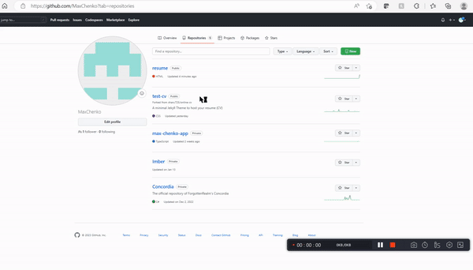

# How to host a Markdown Resume on Github Pages

## **Purpose**

The purpose of this README is to demonstrate how to correctly host a *markdown* format resume on *Github pages*, using a *Jekyll* theme. Please carefully consider the prerequisites prior to starting on the instruction set, and read a follow each step carefully. 

---------

## **Prerequisites**

> The following are some prerequisites required prior to
> starting on the instruction set.

1. Create a Github account on [Github.com](www.github.com)
2. Install [Git](https://git-scm.com/) onto your computer
3. Download the [VSCode code editor](https://code.visualstudio.com/)
4. Resume formatted in Markdown.

If you are unfamiliar with markdown [here is a helpful resource for learning it.](https://www.markdowntutorial.com/)

---------

## **Instructions**

### **The General Process**

According to Etter's principals hosting a resume should follow the below process

1. It should be done on a static site generator. (In our case we will be using Jekyll on Github Pages) Static site generators provide fast and lightweight webpage development and are great for producing documentation and and quick access to static information. Static sites are very easy to update and have no dependencies such as databases or back-end services. This provides and excellent platform for hosting a resume since there is no need for it to contain dynamic information.

2. Using a lightweight mark-up language. (In our case we will be using markdown for formating our resume) Lightweight mark-up languages are great because of their simplicity which makes it incredibly easy for the person writing with it. Often times these languages very much resemble regular text and so they can be read just as easily before the actual effects are applied. Additionally due to their simplicity these mark-up languages are very easy for systems to interpret so very often they can be see in their final format on a regular web browser. This makes it an excellent option for writing our resume because it will be incredibly easy to make changes and reformat if required.

3. Use a version control system. (In our case we will be using Github and Git to store our resume) Version control systems are often used for software development, therefore they may be considered overkill for storing documentation. But it's a rather good way of keeping an eye on previous version of the documents without having to save a bunch of dated copies. In our case it will prove to be quite intuative, to make changes to the resume or revert them if need be.

### **Using Github Pages**

The below instruction set will demonstrate how to host your markdown resume on Github Pages.

1. Open up github.com and sign into your account

2. Create a new repository that will be used to store and host your markdown resume, you may call it whatever you would like. Be sure to check the 'include readme' option.

3. Once your repository is created open up it's webpage. Copy the URL address in the address bar I.E. https://github.com/MaxChenko/resume.

4. On your computer, open up a terminal window and redirect to your desired directory, then type the following command:
        > git clone the-url-address-you-copied
    This will clone the repository onto your computer.

5. Open up VSCode and select the 'Open Folder' option. Navigate to the cloned repository and open it up in VSCode.

6. Create a new folder in the root directory called '_includes', this can be done within VSCode

7. Drag or copy your markdown formatted resume into the '_includes' folder.

8. Create TWO more files that will be stored inside the root directory, the following are the file names and their content.

            _config.yml
                    title: YOUR-NAME
                    description: YOUR-DESCRIPTION

                    # Sets the jekyll pre-exisitng theme
                    theme: jekyll-theme-cayman

                    # Excludes read me file
                    exclude:
                    - README.md
                
            index.html 
                    ---
                    layout: default
                    ---
                    
                    {{ resume_content | markdownify }}

    You may of course replace "YOUR-NAME" and "YOUR-DESCRIPTION" fields in _config.yml, with your desired input. Along with replacing "resume.md" with the file name of the resume you copied into the "_includes" folder.

9. Hit the 'Source control' tab on the left side of your VSCode. 

10. Click the upper '+' in the tab that is labeled as 'Stage all changes'. 

11. Write a short commit message in the topmost prompt bar. 

12. Select the 'Commit' dropdown and click 'Commit and Push'.

13. Go back to the Github repository webpage. And click the rightmost settings option.

14. Click on the 'Pages' option the settings.

15. Select 'Github Actions' as the source.

16. Choose the 'Configure' option on the Jekyll card.

17. Commit the added file to your repository.

18. Navigate back to the Settings->Pages and press the 'Visit Site' button near the top

19. Congratulations You have successfully published an online resume!

### **More Resources**

Here are some other helpful resources that may develop your understanding of the mentioned topics.

- [Markdown Tutorial.](https://www.markdowntutorial.com/)
- [Modern Technical Writing: An Introduction to Software Documentation](https://www.amazon.ca/Modern-Technical-Writing-Introduction-Documentation-ebook/dp/B01A2QL9SS)
- [Git Tutorial](https://git-scm.com/docs/gittutorial)

---------

## **Authors and Acknowledgements**

README written by *Maxim Omelchenko*

Other contributing members:

- Meenal Bhatia 
- Tirenioluwa Biodun-Kuti 
- Yee Tsung Kao

Special aknowledgement of Andrew Etter, the author of Modern Technical Writing: An Introduction to Software Documentation

---------

## **FAQs**

### 